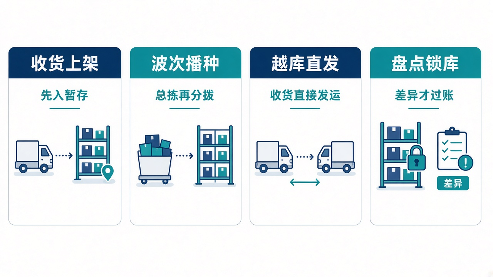
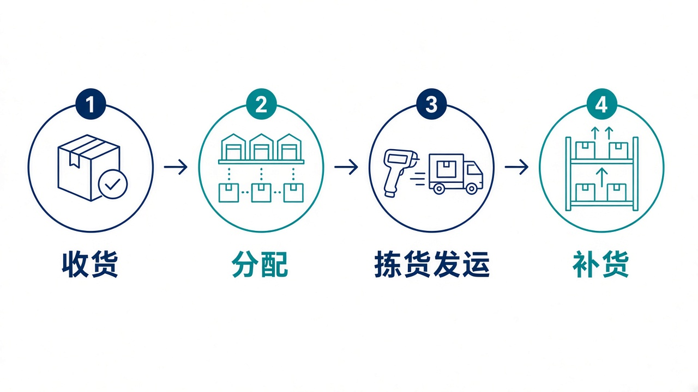

# 给大家讲：仓储系统怎么用

WMS 负责收货、上架、分配、拣货、发运和库内作业。库存记到仓库、库位、货主、物料和批次。控制塔可以按单号分配、按仓补货，库存账仍以本系统为准。亮点短表见 [项目亮点](./项目亮点.md)。

## 适合什么场景

| 场景 | 在这里怎么做 |
| --- | --- |
| 供应商到货 | 按 ASN 收货，先入收货暂存，再上架到推荐库位 |
| 多张出库单要一起拣 | 建成波次，按库位和物料总拣，再按单播种 |
| 货不用上架，到了就发出去 | ASN 绑出库单，收货直接分到发货暂存；多出来的仍走正常上架 |
| 要盘点又不能把库存发出去 | 盘点计划审批后锁库。差异经过复盘和调整单审核才过账 |
| 拣货位不够，别的仓有货 | 同仓走 Min/Max 补货。跨仓先到收货暂存位，确认后才进拣货位 |

## 亮点

1. 分配先看效期，再看收货时间，只从存储位和拣货位出。不够可以部分分配。
2. 波次有八种预置策略，可以先预览再成波。少拣会把缺口释放。
3. 序列号物料收货和发运都要扫号。打包按体积重量推荐箱型，并扣包材。
4. 控制塔重复下发同一条分配或补货，返回第一次的结果。

## 一天怎么用

1. 看工作台的待收货、待上架、待拣货。
2. 收货、质检放行，再确认上架。
3. 出库单分配后拣货、复核、发运。受控序列号必须扫齐。
4. 拣货位低于安全库存就补货。跨仓调拨先扣源仓，货停在目标仓收货暂存位，确认后才进拣货位。

仓号在控制塔里是上海、北京、广州的业务码，落到本系统是 WH01、WH02、WH03。
